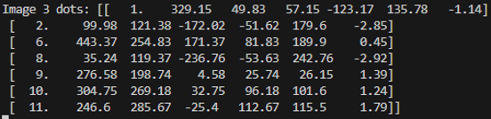
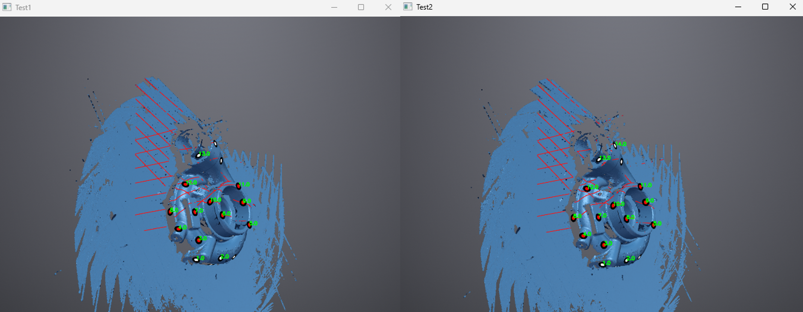
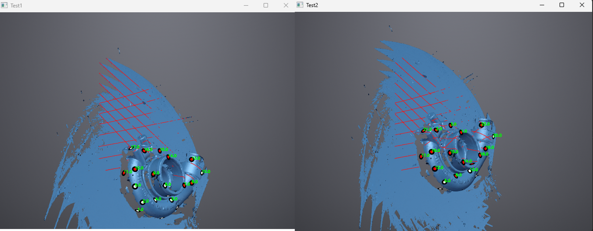

# Dot Detection Development
## Introduction
The dot detection program is part of the image processing section of the project. It is used to identify the location of dots between two images to allow for the trajectory generation program to localise. The program is split into two sections: dot identification, which is used to locate the dots, and dot tracking, which is used to match dots across multiple images. The code is set up within a class allowing variables to be saved internally and the easy calling of functions. A description of the variables and functions can be found here [Dot Detection Code](./dot_detection_documentation.md).

## Requirements
* Identify the reflective dots within screenshots of the Einscan softwares graphical representation of the part.
* ID the dots and list them with their coordinate data within the image.
* Compare previous screenshots to a new screenshot to identify where the dots have moved, update the list of dot ID's with their new locations.
* Identify which dots are new or have disappeared and update the dot list accordingly.

## Dot Identification

The reflective dots within the Einscan software appear as either white or red dots with black circles around them. As such, they can be found by isolating the red channel, turning it into a black and white image, then thresholding at 240. This makes any pixels greater than 240 become 255 and any less than 240 become 0. The dots themselves can then be located using contours, only including those with pixel size greater than 30px^2 as this removes random pixel noise. This process can be seen in the images below fig 1-4. Once contours are located the centre of mass can be identified giving the effective centre of the dot.  
An alternative method would have been to use Hough Circles. This function identifies circles within images by giving them a rating of circulerness. This was not workable, however, as the dots may not appear as complete circles and could easily be mistaken for noise.  
Within the python file this method was implemented using the OpenCV library which contains all the necessary functions required. The code is contained within the function find_dots(). The pixel coordinates are stored within the self.new_dots array, along with the centred coordinates and polar coordinates. The centred coordinates give the location of the dot relative to the centre of the image. This is required as it accounts for potential variation in the size and alignment of the image. The polar coordinates are used later for the dot tracking as they provide a better weighted distance.

Figure 1: Exmaple scan with red/white dots  
 
Figure 2: Exmaple scan with red/white dots  
.png) 
Figure 3: Exmaple scan with red/white dots  
%20thresholded.png) 
Figure 4: Exmaple scan with red/white dots  
 
Table 1: Exmaple scan with red/white dots  

| ID   | Area | Mean| Min | Max | X       | Y       | XM      | YM      |
|------|------|-----|-----|-----|---------|---------|---------|---------|
| 1    | 25   | 255 | 255 | 255 | 240.62  | 156.22  | 240.62  | 156.22  |
| 2    | 6    | 255 | 255 | 255 | 134.5   | 164     | 134.5   | 164     |
| 3    | 30   | 255 | 255 | 255 | 47.033  | 189.267 | 47.033  | 189.267 |
| 4    | 36   | 255 | 255 | 255 | 81.972  | 192.333 | 81.972  | 192.333 |
| 5    | 8    | 255 | 255 | 255 | 345.25  | 222.125 | 345.25  | 222.125 |
| 6    | 9    | 255 | 255 | 255 | 188.722 | 248.056 | 188.722 | 248.056 |
| 7    | 8    | 255 | 255 | 255 | 134.375 | 251.5   | 134.375 | 251.5   |
| 8    | 33   | 255 | 255 | 255 | 292.924 | 290.439 | 292.924 | 290.439 |
| 9    | 13   | 255 | 255 | 255 | 199.5   | 295.5   | 199.5   | 295.5   |

## Dot Tracking
The aim of the dot tracking is to be able to update a list of dots with their coordinates within a new image, and to identify if dots have appeared/disappeared. The code was initially setup using the method found at [1]. This distance based approach purely looks for the closest dot compared to the previous image, and does not account for better matching dots, or dots appearing/disappearing. As such, further research was completed into multi-object tracking. One of the methods that appeared a lot in the literature was the SORT algorithm. The SORT algorithm uses machine learning, a Kalman filter, and the Hungarian Assignment Algorithm (HAA) to track multiple complex objects across frames based upon their potential movement. This works well and requires less processing power, compared to contempory algorithms, so can be applied to live videos [2] [3]. For this project, given the simplicity of the objects and data available, the SORT algorithm is more complex than necessary. However, the HAA that it uses can be applied to this scenario.
The HAA is a method for finding the best set of matches between variables that minimises or maximises overall costs. As such, it is suitable to solve the issue with the original simple object tracking. A python code setup for it was found at [4] and included within the program. 
The code works by taking the polar coordinate distance between every dot and putting them into a numpy array `hungarian_mat`. The distances are limited to less than the cutoff value, this is set by the maximum distance a dot will likely travel, preventing matching with other dots. The `hungarian mat` has dimensions (n, n) where n is the maximum size out of the old and new dots. This allows the HAA to simulate adding/removing dots by having a row/column of zeroes, if a dot can't be matched it will be matched with the empty column indicating a removal. `hungarian mat` is then passed to the HAA which returns a list of matches. The matches are then split and categorised as either direct matches, new or lost. The code then run throughs each of these lists updating `current_dots`.

## Testing
### Initial Verification
To test the efficacy of the dot detection tracking across multiple images, 3 screenshots of the part were taken from a screen recording of a handheld scan of the test part with an interval of 1 second. Due to the nature of the scan, the part does not perfectly sit centrally meaning there will be increased variability in the location of the part within the image. These images were run through the algorithm in turn with `current_dots` being printed each time and the images being overlaid with identified dots. This allowed for a visual check of how the algorithm performed. The results can be seen in figure 5 below. The algorithm can successfully match all but two of the dots across all three images. Dot 4 in the first image is misidentified as a new dot in image 2, with dot 4 becoming a new dot. This is likely because the distance between 4 and 9 is low meaning the HAA identified it as a suitable match. This problem should be solveable by reducing the distance travelled between images and better tuning of the systems parameters. This will be done later on once the scanner has been mounted to the robot.

Figure 5: Tracking algorithm test results  
 
Figure 6: `current_dots` array for image 3  
 

### Testing with Images from the Robot
Images were gathered from the laser scanner mounted to the robot. These were taken in four observation positions around the part determined by the trajectory generation algorithm. The images were gathered using the screenshot code, giving test cases similar to those in the final program. The results from two of the tests can be seen below in figures 7 and 8. 

Figure 7: Dot tracking across the two images at observation position 2 
 
Figure 8: Dot tracking across the two images at observation position 2 
 

Figure 7, which shows the images in observation position 1 was the best result out of the 4. The part within the screenshot does not vary between the two images in position, meaning the dot detection algorithm was able to succesffuly track all 13 dots and identify a new one. However, the images in figure 8 show the part in observation position 2. Between the two images the part moves linearly across the screenshot. This is a problem as the dot detection only works if the part stays centred. As such, none of the dots tracked correctly. The reason for this is due to the issues surrounding the TCP offset of the laser scanner. As this could not be appropriately accounted for, when the robot moves, it does not follow the intended path. This leads to the part moving across the screen as the centre point it moves around is incorrect.  
Going forwards this problem would need to be resolved by gathering the accurate offset data, ensuring the part stays centred at all times.

## References
[1]: A. Rosebrock, “Simple object tracking with OpenCV,” PyImageSearch, Jul. 23, 2018. https://pyimagesearch.com/2018/07/23/simple-object-tracking-with-opencv/ 
[2] Sanyam, “Understanding Multiple Object Tracking using DeepSORT,” LearnOpenCV, Jun. 21, 2022. https://learnopencv.com/understanding-multiple-object-tracking-using-deepsort/ 
[3] E. Komagal et al., “Moving Object Detection and Tracking in Wide Area Surveillance using Hungarian-Kalman Algorithm.” Accessed: Dec. 10, 2025. [Online]. Available: https://www.ijert.org/research/moving-object-detection-and-tracking-in-wide-area-surveillance-using-hungarian-kalman-algorithm-IJERTCONV5IS09032.pdf  
[4]: Eason, “Hungarian Algorithm Introduction & Python Implementation,” Medium, Aug. 02, 2021. https://python.plainenglish.io/hungarian-algorithm-introduction-python-implementation-93e7c0890e15 
