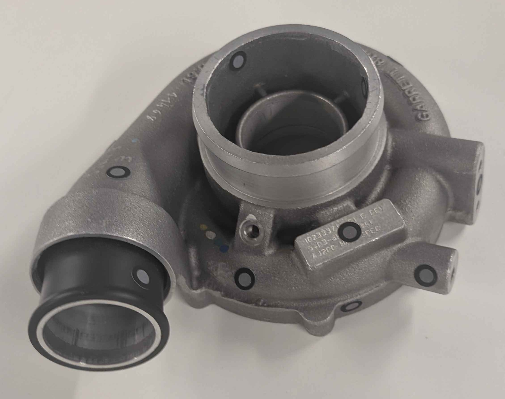
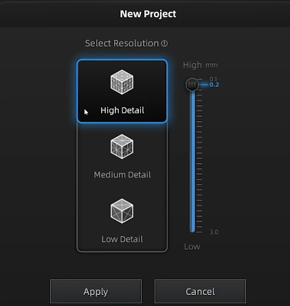

# Project Setup and Experimentation

## Scanner Preperation & Object selection

The first step was setting up the Einscan HX using the proprietary shining 3D software. The software handles the laser scanning process and the calibration.

Secondly an Object was chosen which fit the criteria for this project such as:

- Complex gemoetry
- Metatllic surface 
- Suitable size for scanning
- Multiple hidden regions
- Industrial component

Retro reflective markers were placed on the object surface. These markers allow the software to identify the object for laser scanning.

## Inital Scanning Process

Multiple 360° scans were performed using the Einscan HX scanner on the object with different quality settings such as high quality, medium quality and low quality. The difference in quality is based on point spacing. For example, high detail has small point spacing (0.1 - 0.2 mm) which means there is less distance between points, creating a denser point cloud.

### High quality scan

<iframe width="560" height="315" src="https://www.youtube.com/embed/AgiyfbiQujc?si=6LhLRWmq3dH_4au9" title="YouTube video player" frameborder="0" allow="accelerometer; autoplay; clipboard-write; encrypted-media; gyroscope; picture-in-picture; web-share" referrerpolicy="strict-origin-when-cross-origin" allowfullscreen></iframe>

### Medium quality scan
<iframe width="560" height="315" src="https://www.youtube.com/embed/7uTEE94zOBQ?si=_MC891vxYdaOZJzS" title="YouTube video player" frameborder="0" allow="accelerometer; autoplay; clipboard-write; encrypted-media; gyroscope; picture-in-picture; web-share" referrerpolicy="strict-origin-when-cross-origin" allowfullscreen></iframe>

### Low quality scan
<iframe width="560" height="315" src="https://www.youtube.com/embed/84lJhVLyIkc?si=NXDlwlj8titRoRPp" title="YouTube video player" frameborder="0" allow="accelerometer; autoplay; clipboard-write; encrypted-media; gyroscope; picture-in-picture; web-share" referrerpolicy="strict-origin-when-cross-origin" allowfullscreen></iframe>

### Very low quality scan

<iframe width="560" height="315" src="https://www.youtube.com/embed/0h9UlIu9WmU?si=OCUoKQ2Qpq41Lr0N" title="YouTube video player" frameborder="0" allow="accelerometer; autoplay; clipboard-write; encrypted-media; gyroscope; picture-in-picture; web-share" referrerpolicy="strict-origin-when-cross-origin" allowfullscreen></iframe>

## Image-Based Coverage Analysis 
The EinScan HX software does not allow direct access to the 3D point cloud data during real time. To work around this limitation, we implement image based analysis which uses the visual output of the software to detect any gaps or missing regions. More information regarding this approach can be found [here](Coverage_algorithm.md)