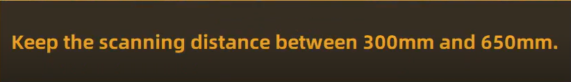

# Screenshot and System Error Development
## Introduction
This section of the code looks to ensure the system can respond to errors arising from the Einscan software and capture the screenshot required for the image processing. The code is setup within a class that the main program can call upon. The warnings are indicated using boolean variables which act as flags for each error type. A detailed breakdown of the code can be found at [Screenshot and System Error Documentation](./get_screenshot_documentation.md). The screenshot is returned as a numpy array as this is an easily passable type that the OpenCV library can interpret.
## Einscan Status Check
As the program is reliant upon the use of the Einscan HX software one of the first checks to take place is to make sure that it is open and running. This is done within the code using the function `einscan_status`. It uses the `PyUtil` `.process_iter()` and `.info()` methods to iterate through the current programs running on the PC to check for `EXScan HX.exe`, which is the program name of the Einscan software. If it is found, the variable `warn_ex_closed` is set to False. If not `warn_ex_closed` is set to True, allowing the main program to indicate to the user that it needs to be opened.

## Screenshot
The image processing section of the program requires a screenshot of the Einscan softwares representation of the 3D scan to be taken. As such, this section looks at how this was implemented with the specific part region of interest being returned.  
The initial plan was to look into if it was possible to take a screenshot of purely the `EXScan HX.exe` window. While there are many Python libraries that can take screenshots, few provide a method for imaging a specific window. Out of these `wgcapture` [1] appeared to be the best solution, however, due to `.dll` file issues it was unworkable. Additionally, when behind other program windows, programs tend to stop updating their graphics to save processing capacity, this would mean when the screenshot is taken the Einscan software would be frozen on a previous pose. Therefore, another approach was required. Another system that provides a similar functionality is the Microsoft Teams or Discord screenshare tools. This allows the system to show a specific window independent of what is on the desktop. This method effectively interupts the graphics data being sent from the software to the desktop and sends it to another user [2] [3]. While functional for it's application, it requires a great deal of processing power, which is already limited by the Einscan softwares high graphic can memory demands. An alternative solution decided upon was to minimise all windows but the Einscan software, then take a screenshot using one of the Python libraries then reopen all. In practice this would require the user to close all windows except the Einscan software and UI app, which on a application specific PC shouldn't be unreasonable.

The fullscreen screenshot is taken by running the `take_screenshot` method. When called the method creates a list of all open programs and minimises all but `EXScan HX.exe`. The dxcam `.create` method is then called to capture the fullscreen with OpenCVs `cvtColor` method being called to readjust the colour to the OpenCV format. The resulting numpy array is then assigned to the `full_screenshot` variable, with the `warn_no_image` variable being set to false. The `full_screenshot` is then available for the `get_roi` and `warning_check` functions to be run.

The part region of interest is gathered by indexing the `full_screenshot` numpy array. A predetermined pixel height and width are used to determine the size of the roi around the centre of the screen, they are currently set at 324 and 576 respectively as this is a third of a 1080x1920px screen but this may change during tuning. The height and width are then converted to pixel coordinates for indexing as the top left and bottom right corners of the roi. This indexed array is assigned to the `roi_image` variable for use within the image processing sections of the program.

## Error Checking
The error checking section of the code aims to identify when the robot has run into one of the scanner errors. When the scanner is operating it must remain within a set distane from the part and be able to identify at least three dots. If this is not true the software will display one of two errors {figures}. Template matching was implemented to do this as it is able to identify matching areas of an image to a selected template, based on the figures below.

Figure 1: Template of the Einscan software tracking lost error  
  
Figure 2: Template of the Einscan software distance error  
  

`warning_check` can be run to identify {figures} in `full_screenshot`. It makes use of OpenCVs `match_template` method which returns the best match value between 0 and 1, 1 being a perfect match. When both templates were used the matches were always above 0.9 whereas with the wrong or no error it was below 0.2. As such, these limits were used to determine whether the boolean variables for each `warn_dist` and `warn_track_lost` are set to true. If neither are located the variables are reset to False.

## References
[1] “piwheels - wgcapture,” Piwheels.org, 2025. https://www.piwheels.org/project/wgcapture/  
[2] J. Stratton, “How It All Goes Live: An Overview of Discord’s Streaming Technology,” Engineering & Developers, Mar. 05, 2024. https://discord.com/blog/how-it-all-goes-live-an-overview-of-discords-streaming-technology?utm_source=blog.quastor.org&utm_medium=referral&utm_campaign=how-discord-s-live-streaming-works (accessed Feb. 18, 2026) 
[3] CarolynRowe, “Microsoft Teams call flows - Microsoft Teams,” learn.microsoft.com, Aug. 30, 2021. https://learn.microsoft.com/en-us/MicrosoftTeams/microsoft-teams-online-call-flows