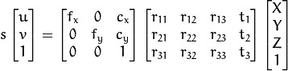
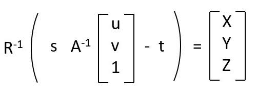
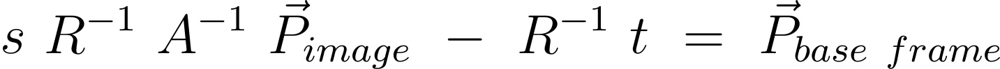
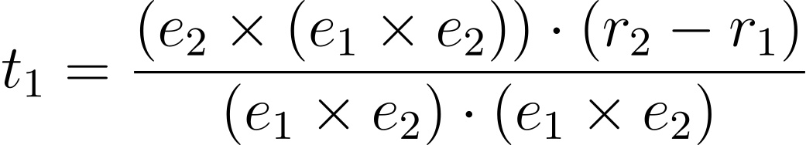
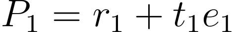

# Pose estimation

It can be assumed that given an unknown region within a scanned area, there is an optimal pose which will gather all undiscovered data. Due to technical limitations though, the unknown region must be modelled as an external facing surface, which means some internal geometry cannot be properly scanned. When considering the operating range of the scanner of 30 to 65cm, the observation point must effectively lie within a dome centred on the unknown region. If the object can then be enclosed within a 15cm radius dome, then using a second dome of 45cm radius for the scanner can guarantee that all features are visible in range at some point. Therefore, the optimal pose of the scanner is a point on this larger sphere of observations where the scanner is pointed at the unknown region on the object.

To find this pose a point representing the unknown regions centre must be found. Due to technical limitations the point cloud data produced by the scanner is not accessible and therefore the only way to generate any information related to the scan's progress is to record the GUI. This means that the only way to produce the positioning data is through image processing-based techniques. Fortunately, the system's GUI has a visualisation of the scanned part which rotates with the scanner so that the information can be accessed without stopping the scan.

## Position reconstruction

The fundamental theory of 3d position reconstruction is as follows:

Image taken from [^1]

This can be redefined as:

Image taken from [^2]

Which is equivalent to:

latex of s\ R^{-1}\ A^{-1}\ \vec{P}_{image}\ -\ R^{-1}\ t\ =\ \vec{P}_{base\ frame}

Where R^-1 * t represents the robot's tool position.

And R^-1 * A^-1 is the inverse rotation matrix multiplied by the inverse intrinsic matrix of the camera.

S is an unknown scalar variable which is equivalent of depth, this is extracted for later use.

And the P vectors represent position of the point in the image and base frame respectively. The image position can be retrieved from dot tracking and unknown region identifier. The base frame is the points position in reference to where the base of the robot is.

## Depth estimation

With the aforementioned equation, the depth value is unknown but because the reflective dots can be tracked across movement, their 3D position can be estimated. This requires the scanner to move to another position with the robot arm to get another combination of position data and an image of the scanned component. The depth of the centre of the unknown area is the average of the known depths weighted based on the reciprocal of their distance to the unknown point in the image. The known points can be used to make two 3D lines which can be used in the equation below to estimate the closest point of intersection to estimate the depth of the initial images points.

formula taken from [^3]

where the vectors follow the form

where P is the points position

r1 is the origin of the line

e1 is the gradient of the line

t1 is the depth of the line

## Observation point derivation

Once the 3d point of the unknown area's centre is constructed, a line from that point to the dome of observation can be made. This new point can then be converted into a pose by calculating the angle of roll, pitch and yaw from the position to the centre of the workspace. Roll is kept constant due to no active need to rotate the scanner proactively. Pitch is derived from the arctan of the x and z values from the world centre to the new point. Yaw is the arctan of the y and the hypotenuse of the triangle formed by the x and z values.

## Trajectory generation

Once the pose is generated it is checked if it is to far from the previous pose and if so an intermediary waypoint is created to prevent the camera from violating the objects space. These poses are then added to the end of a queue for ease of handling with the robots control system. The robot then will use arc movement to go between its current position and the next. This will require reuse of the waypoint code to create the third point needed to create an arc.

## Bibliography
[^1]: “Reconstruction in OpenCV.” Accessed: Dec. 11, 2025. [Online]. Available: https://www.opencvhelp.org/tutorials/advanced/reconstruction-opencv/

[^2]: “Calculate X, Y, Z Real World Coordinates from Image Coordinates using OpenCV (from fdxlabs) | by Paco Garcia | Medium.” Accessed: Jan. 11, 2026. [Online]. Available: https://medium.com/@pacogarcia3/calculate-x-y-z-real-world-coordinates-from-image-coordinates-using-opencv-from-fdxlabs-0adf0ec37cef

[^3]: “geometry - Find shortest distance between lines in 3D - Mathematics Stack Exchange.” Accessed: Feb. 18, 2026. [Online]. Available: https://math.stackexchange.com/questions/2213165/find-shortest-distance-between-lines-in-3d

