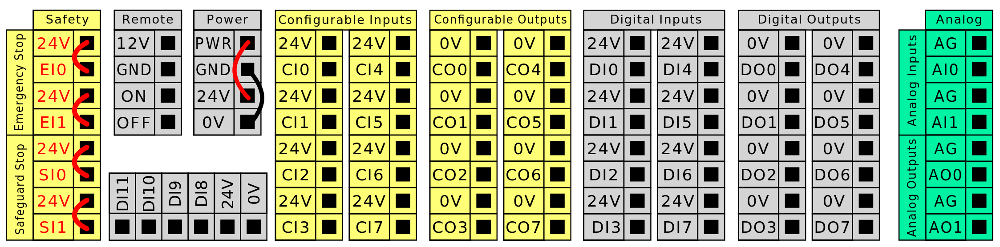

> **Important:** The robot listed on this page is the robot we expect this system to be using in production. Testing will be done on a UR5 CB3, which is an older version of the UR5e with minor differences.
{: .important }

# Universal Robots UR5e Collaborative Industrial Robot Arm

The Universal Robots UR5e is a collaborative industrial robot arm. Collaborative robots, often shorted to cobots are robots which are designed to be able to perform tasks in collaboration with workers, having a number of technical features such as lightweight materials, padding and embedded sensors to reduce the risk of harm to humans.[^1]

## Table of Contents
{:toc}

## Technical Specifications

The UR5e's technical specifications are listed in the UR5e user manual.[^2]

<table>
  <thead>
    <tr>
      <th>Specification</th>
      <th>UR5e</th>
    </tr>
  </thead>
  <tbody>
    <tr><td>Robot type</td><td>UR5e</td></tr>
    <tr><td>Robot weight</td><td>20.7 kg / 45.7 lb</td></tr>
    <tr><td>Maximum payload</td><td>5 kg / 11 lb</td></tr>
    <tr><td>Reach</td><td>850 mm / 33.5 in</td></tr>
    <tr><td>Joint ranges</td><td>Unlimited rotation of tool flange, ±360° for all other joints; ±360° for all joints</td></tr>
    <tr><td>Speed</td><td>Joints: Max 180°/s; Tool: Approx. 1 m/s / Approx. 39.4 in/s</td></tr>
    <tr><td>System update frequency</td><td>500 Hz</td></tr>
    <tr><td>Force Torque sensor accuracy</td><td>4 N</td></tr>
    <tr><td>Pose repeatability</td><td>±0.03 mm / ±0.0011 in (1.1 mils) per ISO 9283</td></tr>
    <tr><td>Footprint</td><td>Ø149 mm / 5.9 in</td></tr>
    <tr><td>Degrees of freedom</td><td>6 rotating joints</td></tr>
    <tr><td>Control Box size (W × H × D)</td><td>460 mm × 449 mm × 254 mm / 18.2 in × 17.6 in × 10 in</td></tr>
    <tr><td>Control Box I/O ports</td><td>16 digital in, 16 digital out, 2 analog in, 2 analog out</td></tr>
    <tr><td>Tool I/O ports</td><td>2 digital in, 2 digital out, 2 analog in</td></tr>
    <tr><td>Tool Communication</td><td>RS</td></tr>
    <tr><td>Tool I/O power supply & voltage</td><td>12 V/24 V 1.5 A (Dual pin) 1 A (Single pin)</td></tr>
    <tr><td>Control Box I/O power supply</td><td>24 V 2 A in Control Box</td></tr>
    <tr><td>Communication</td><td>TCP/IP 1000 Mbit: IEEE 802.3ab, 1000BASE-T Ethernet socket, MODBUS TCP & EtherNet/IP Adapter, Profinet</td></tr>
    <tr><td>Programming</td><td>PolyScope graphical user interface on 12&quot; touchscreen</td></tr>
    <tr><td>Noise</td><td>Robot Arm: Less than 60dB(A) Control Box: Less than 50dB(A); Robot Arm: Less than 65dB(A) Control Box: Less than 50dB(A)</td></tr>
    <tr><td>IP classification</td><td>IP54</td></tr>
    <tr><td>Cleanroom classification</td><td>Robot Arm: ISO Class 5, Control Box: ISO Class 6</td></tr>
    <tr><td>Power consumption (average)</td><td>570 W</td></tr>
    <tr><td>Power consumption (approx.)</td><td>Approx. 250 W using a typical program</td></tr>
    <tr><td>Short-Circuit Current Rating (SCCR)</td><td>200A</td></tr>
    <tr><td>Collaboration operation</td><td>17 advanced safety functions. In compliance with: EN ISO 13849-1, PLd, Cat.3 and EN ISO 10218-1</td></tr>
    <tr><td>Materials</td><td>Aluminium, PC/ASA plastic</td></tr>
    <tr><td>Ambient temperature range</td><td>0–50 °C. At ambient temperatures above 35°C, the robot may operate at reduced speed and performance.</td></tr>
    <tr><td>Control Box power source</td><td>100–240 VAC, 47–440 Hz</td></tr>
    <tr><td>TP cable: Teach Pendant to Control Box</td><td>4.5 m / 177 in</td></tr>
    <tr><td>Robot Cable: Robot Arm to Control Box (options)</td><td>Standard (PVC) 6 m / 236 in × 13.4 mm; Standard (PVC) 12 m / 472.4 in × 13.4 mm; Hiflex (PUR) 6 m / 236 in × 12.1 mm; Hiflex (PUR) 12 m / 472.4 in × 12.1 mm</td></tr>
  </tbody>
</table>

## Safety Instructions
**The robot comes with a set of general safety instructions, which are listed below:**[^3]

Failure to adhere to the general safety practices, listed below, can result in
injury or death.
- Verify the robot arm and tool/end effector are properly and securely
bolted in place.
- Verify the robot application has ample space to operate freely.
- Verify the personnel are protected during the lifetime of the robot
application including transport, installation, commissioning,
programming/ teaching, operation and use, dismantling and
disposing.
- Verify robot safety configuration parameters are set to protect
personnel, including those who can be within reach of the robot
application.
- Avoid using the robot if it is damaged.
- Avoid wearing loose clothing or jewelry when working with the robot.
Tie back long hair.
- Avoid placing any fingers behind the internal cover of the Control Box.
- Inform users of any hazardous situations and the protection that is
provided, explain any limitations of the protection and the residual
risks.
- Inform users of the location of the emergency stop button(s) and how
to activate the emergency stop in case of an emergency or an
abnormal situation.
- Warn people to keep outside the reach of the robot, including when
the robot application is about to start-up.
- Be aware of robot orientation to understand the direction of movement
when using the Teach Pendant.
- Adhere to the requirements and guidance in ISO 10218-2.

Handling tools/end effectors with sharp edges and/or pinch points can result in
injury.
- Make sure tools/end effectors have no sharp edges or pinch points.
- Protective gloves and/or protective eyeglasses could be required.

Prolonged contact with the heat generated by the robot arm and the Control Box,
during operation, can lead to discomfort resulting in injury.
- Do not handle or touch the robot while in operation or immediately after
operation.
- Check the temperature on the log screen before handling or touching the
robot.
- Allow the robot to cool down by powering it off and waiting one hour.

## Risk Assessment
**The user manual further includes a guide for performing risk assessments with the UR5e, which is listed below:**

__Description__
The risk assessment is a requirement that shall be performed for the application. The
application risk assessment is the responsibility of the integrator. The user can also be
the integrator.
The robot is partly completed machinery, as such the safety of the robot application
depends on the tool/end effector, obstacles and other machines. The party performing
the integration must use ISO 12100 and ISO 10218-2 to conduct the risk assessment.
Technical Specification ISO/TS 15066 can provide additional guidance for collaborative
applications. The risk assessment shall consider all tasks throughout the lifetime of the
robot application, including but not limited to:
- Teaching the robot during set-up and development of the robot application
- Troubleshooting and maintenance
- Normal operation of the robot application
A risk assessment must be conducted before the robot application is powered on for the
first time. The risk assessment is an iterative process. After physically installing the
robot, verify the connections, then complete the integration. A part of the risk
assessment is to determine the safety configuration settings, as well as the need for
additional emergency stops and/or other protective measures required for the specific
robot application.

__Safety configuration settings__
Identifying the correct safety configuration settings is a particularly important part of
developing robot applications. Unauthorized access to the safety configuration must be
prevented by enabling and setting password protection.
WARNING
Failure to set password protection can result in injury or death due to
purposeful or inadvertent changes to configuration settings.
- Always set password protection.
- Set up a program for managing passwords, so that access is
only by persons who understand the effect of changes.
Some safety functions are purposely designed for collaborative robot applications.
These are configurable through the safety configuration settings. They are used to
address risks identified in the application risk assessment.
The following limit the robot and as such can affect the energy transfer to a person by
the robot arm, end effector and workpiece.
- Force and power limiting: Used to reduce clamping forces and pressures
exerted by the robot in the direction of movement in case of collisions between
the robot and the operator.
- Momentum limiting: Used to reduce high transient energy and impact forces in
case of collisions between robot and operator by reducing the speed of the robot.
- Speed limitation: Used to ensure the speed is less that the configured limit.
The following orientation settings are used to avoid movements and reduce exposure of
sharp edges and protrusions to a person.
- Joint, elbow and tool/end effector position limiting: Used to reduce risks
associated with certain body parts: Avoid movement towards head and neck.
- Tool/end effector orientation limiting: Used to reduce risks associated with
certain areas and features of the tool/end effector and work-piece: Avoid sharp
edges being pointed towards the operator, by turning the sharp edges inward
towards the robot.

__Safety configuration settings__
Identifying the correct safety configuration settings is a particularly important part of
developing robot applications. Unauthorized access to the safety configuration must be
prevented by enabling and setting password protection.
WARNING
Failure to set password protection can result in injury or death due to
purposeful or inadvertent changes to configuration settings.
- Always set password protection.
- Set up a program for managing passwords, so that access is
only by persons who understand the effect of changes.
Some safety functions are purposely designed for collaborative robot applications.
These are configurable through the safety configuration settings. They are used to
address risks identified in the application risk assessment.
The following limit the robot and as such can affect the energy transfer to a person by
the robot arm, end effector and workpiece.
- Force and power limiting: Used to reduce clamping forces and pressures
exerted by the robot in the direction of movement in case of collisions between
the robot and the operator.
- Momentum limiting: Used to reduce high transient energy and impact forces in
case of collisions between robot and operator by reducing the speed of the robot.
- Speed limitation: Used to ensure the speed is less that the configured limit.
The following orientation settings are used to avoid movements and reduce exposure of
sharp edges and protrusions to a person.
- Joint, elbow and tool/end effector position limiting: Used to reduce risks
associated with certain body parts: Avoid movement towards head and neck.
- Tool/end effector orientation limiting: Used to reduce risks associated with
certain areas and features of the tool/end effector and work-piece: Avoid sharp
edges being pointed towards the operator, by turning the sharp edges inward
towards the robot.

__Stopping performance risks__
Some safety functions are purposely designed for any robot application. These features
are configurable through the safety configuration settings. They are used to address
risks associated with the stopping performance of the robot application.
The following limit the robot stopping time and stopping distance to ensure stopping will
occur before reaching the configured limits. Both settings automatically affect the speed
of the robot to ensure the limit is not exceeded.
- Stopping Time Limit: Used to limit the stopping time of the robot.
- Stopping Distance Limit: Used to limit the stopping distance of the robot.
If either of the above is used, there is no need for manually performed periodic stopping
performance testing. The robot safety control does continuous monitoring.
If the robot is installed in a robot application where hazards cannot be reasonably eliminated or
risks cannot be sufficiently reduced by use of the built-in safety-related functions (e.g. when
using a hazardous tool/end effector,or hazardous process), then safeguarding is required. See
ISO 10218-2.

__Potential Hazards__
Universal Robots identifies the potential significant hazards listed below for consideration
by the integrator. Other significant hazards can be associated with a specific robot
application.
- Penetration of skin by sharp edges and sharp points on tool/end effector or
tool/end effector connector.
- Penetration of skin by sharp edges and sharp points on nearby obstacles.
- Bruising due to contact.
- Sprain or bone fracture due to impact.
- Consequences due to loose bolts that hold the robot arm or tool/end effector.
- Items falling out of, or flying from the tool/end effector, e.g. due to a poor grip or
power interruption.
- Mistaken understanding of what is controlled by multiple emergency stop buttons.
- Incorrect setting of the safety configuration parameters.
- Incorrect settings due to unauthorized changes to the safety configuration
parameters.

# UR5e Connection Interfaces
In this section we will cover the robot's various hardware and firmware communication interfaces that can be used to control the robot.

## Control Box I/O
The UR5e's control box has a panel of I/O ports intended for direct wiring. These are mainly intended for connecting the robot to external industrial and safety equipment like emergency stop circuits and programmable logic controllers. They are not appropriate for connection to a microcontroller as they run at 24V whether internally or externally powered, and because of the low resolution of the connection as each port is a binary digital input/output. 

## 8P8C Port (Ethernet)

The UR5e also has an 8P8C port used for Ethernet connection. This connection also supports some industrial protocols like MODBUS TCP, Profinet and OPC UA.

### Industrial Protocols

While the robot supports multiple industrial protocols such as Modbus TCP, Profinet and OPC UA, the way these interface with the robot is fundamentally similar. The protocols can each read and write values to a set of registers that are shared between the industrial controller and the robot's internal controller. The robot's internal programming then determines how the system responds to the values set in these registers. As such none of these systems can fully remote control the robot, and can be compared to the robot's native RTDE interface that provides access to the same registers.

### Client Interfaces

The robot also exposes a series of interfaces that can be connected to directly using server sockets. These are the primary and secondary interfaces as well as the real time data exchange (RTDE) interface which replaces the older deprecated real-time interface, all of which handle data exchange via registers. The robot can also be controlled through the dashboard server socket, as well as the URScript interpreter socket. There are also even more socket that haven't been considered here.

## Bibliography
[^1]: International Federation of Robotics (IFR), Demystifying Collaborative Industrial Robots – Positioning Paper, updated December 2020. Available: https://www.automate-uk.com/media/4jmhne5p/ifrdemystifyingcollaborativerobotsupdatev03dec2020.pdf \[Accessed: 03-Nov-2025\]
[^2]: Universal Robots A/S, UR5e – User Manual (Original Instructions), e-Series, 2009–2024. [Online]. Available: https://www.universal-robots.com/manuals/EN/PDF/SW5_19/user-manual-UR5e-PDF_online/710-965-00_UR5e_User_Manual_en_Global.pdf \[Accessed: 03-Nov-2025\]
[^3]: Universal Robots A/S, UR e-Series Functional Safety 01-Dec-2022. Availlable: https://s3-eu-west-1.amazonaws.com/ur-support-site/71045/UR%20e-Series%20Functional%20Safety%202022%201201.pdf \[Accessed: 06-Nov-2025\]